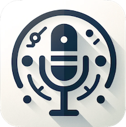

  

# RecordToText
このアプリは**オーディオの入力デバイス**を録音し、一定期間毎に自動で文字起こしとサマリーを作成します。  
文字起こしの間隔は設定画面でカスタマイズできます。`Flutter for macOS`で動作します。

# 設計
大まかな機能と設計は以下の通りです。

## 録音機能
システムのオーディオ入力をキャプチャして録音します。録音は`Record`ライブラリを使っています。  
連続性を確保するため録音は一時停止せずに行い、バックグラウンドで定期的に音声データのセグメントを保存し一時フォルダにファイルで出力します。  
テキスト変換機能で文字起こしに使用しているAPIの仕様を考慮し、音声データが大きくならないようMAXでも10分で分割するようにしています。

## テキスト変換機能
出力したファイルを読み込み、OpenAIの`Whisper API`で文字起こしします。  
文字起こしした内容は`gpt-3.5-turbo`モデルを使用してフィラーを除去することも検討していますが、公式ドキュメントに  
`The model may also leave out common filler words in the audio`   
という一文もあるため一旦はそのまま出力してみて様子見しようと思います。  

## サマリー生成
各音声データの文字列を順番に結合し`gpt-4o`モデルを使用してサマリーを生成します。  
当初、Context長の制御処理を入れるか検討しましたが、以前に比べてContext長が格段に長くなったことと分割してサマリーを作るより全てつなげてサマリーを作った方がブレが少ないという結論になり、まとめて作成することにしました。  

# 制限事項
1. サマリー作成時にContext長を考慮していない
   1. 上記「サマリー生成」で記載した通り。最近のGeminiやClaude3ならContext長が十分あるのでそっちを使った方が良いかもしれません。
2. ヘッドフォンやイヤホンでの録音は自分の声しかのらない
   1. 音源の出力インタフェースはFlutterのRecordでは拾えないので、イヤホンやヘッドフォンをしながらの会議などの議事録には使えません。
   2. Loopback Audio機能を提供したライブラリがあれば実現可能かもしれません。

# スクリーンショット
  
  
  